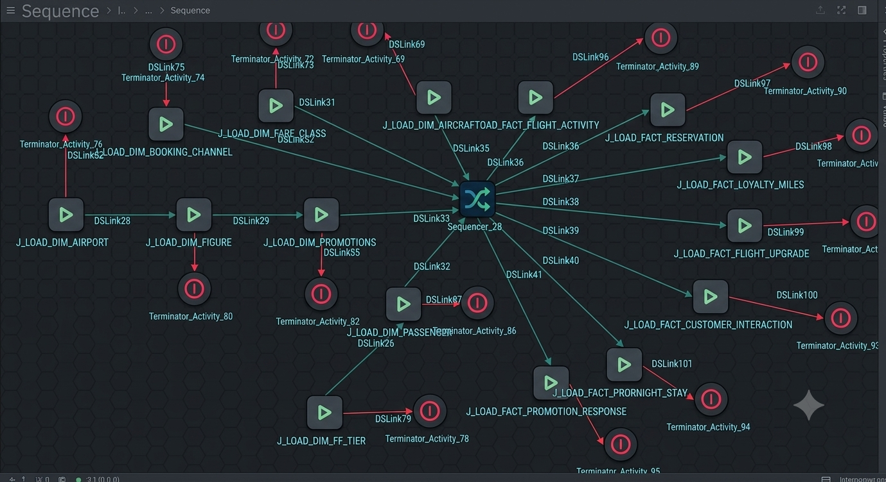
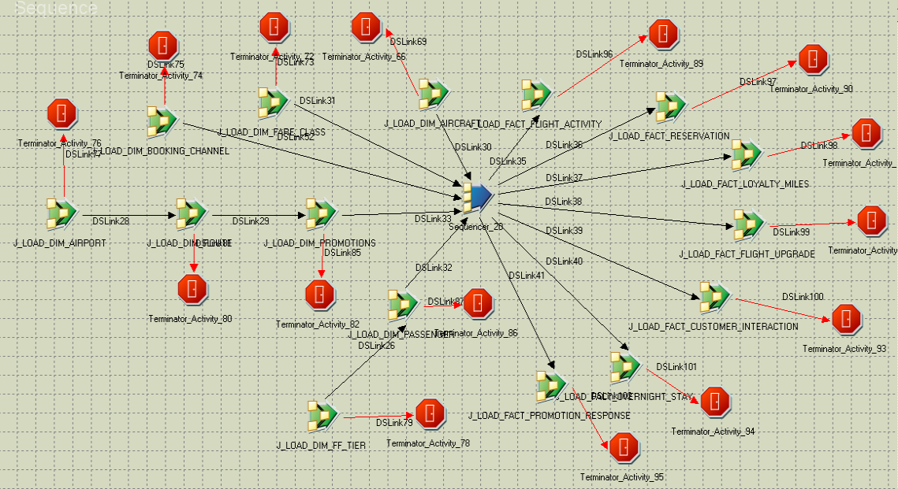
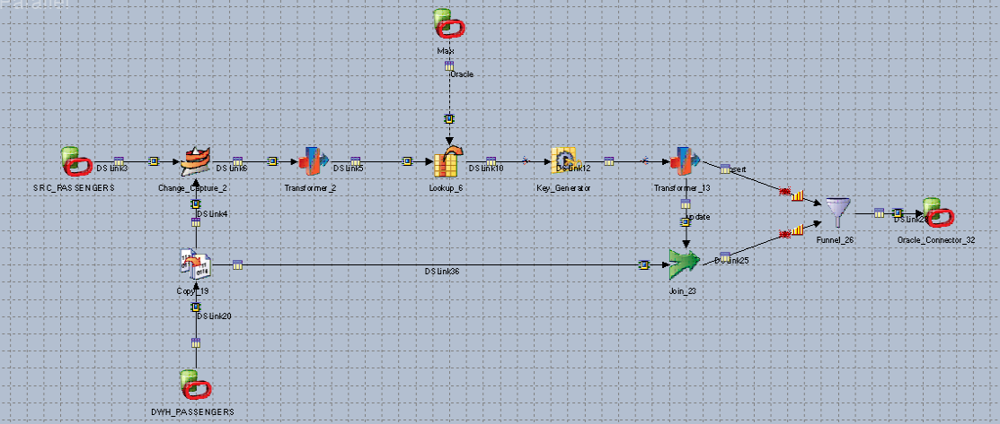
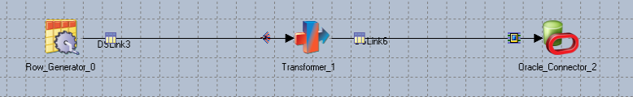

# Airline Enterprise Data Warehouse (EDW) & DataStage ETL Pipeline
## Project Documentation



This comprehensive documentation details the implementation of an end-to-end Enterprise Data Warehouse (EDW) designed to support an enterprise airline's core commercial operations, customer interactions, loyalty programs, and financial performance tracking. 

The analytical platform architecture features a robust **DataStage ETL pipeline** utilizing custom error recovery, checkpointing, and advanced data transformation patterns to safely migrate source transactional datasets into a highly optimized, partitioned Star Schema model.

---

## 1. Business & Dimensional Modeling Process

To map transactional source systems to specific business workflows, we apply the Kimball Dimensional Modeling methodology using a 4-step design process across **7 distinct business processes**:

1. **Select the Business Process:** Identifying the operational workflow to measure.
2. **Declare the Grain:** Establishing exactly what a single row in the fact table represents.
3. **Identify the Dimensions:** Determining the context (Who, What, Where, When, Why) surrounding the process.
4. **Identify the Facts:** Determining the numeric, quantifiable metrics generated by the process.

### Business Process Breakdown

#### 1. Flight Operations & Activity
*   **Business Objective:** Monitor flight statuses, delays, operating durations, seat inventory availability, and operating cost metrics to evaluate profitability and scheduling efficiency.
*   **Grain:** One row per individual flight operation instance (`FLIGHT_ID`).
*   **Dimensions:** `DIM_DATE`, `DIM_ROUTE`, `DIM_AIRCRAFT`.
*   **Facts:** Departure/Arrival delays, actual duration, seating availability across three cabin classes, individual operational cost breakdowns (fuel, crew, maintenance, catering, airport fees), and total flight cost.

#### 2. Booking & Revenue Reservations
*   **Business Objective:** Evaluate reservation volume, distribution channel performance, ticketing status, cash flow, and exact profit realizations per ticket issued.
*   **Grain:** One row per unique reservation ticket mapping (`TICKET_ID` combined with `RESERVATION_ID`).
*   **Dimensions:** `DIM_DATE` (Dual-roled: Booking Date, Ticket Issue Date), `DIM_PASSENGER` (SCD Type 2), `DIM_ROUTE`, `DIM_FARE_CLASS`, `DIM_BOOKING_CHANNEL`, `DIM_PROMOTION`.
*   **Facts:** Total amount paid, itemized pricing (base fare, taxes, fees, applied discounts), final ticket net amount, loyalty miles metrics (earned/redeemed), and computed net profit (`PROFIT_USD`).

#### 3. Loyalty Miles Ledger
*   **Business Objective:** Keep an audit trail of frequent flyer mileage movements (earning, redemption, expirations, promotions) to evaluate liability balances and customer engagement.
*   **Grain:** One row per loyalty mile ledger transaction (`TRANSACTION_ID`).
*   **Dimensions:** `DIM_DATE` (Transaction Date), `DIM_PASSENGER` (SCD Type 2).
*   **Facts:** Net change in miles volume (`MILES_AMOUNT`).

#### 4. Customer Service Interactions
*   **Business Objective:** Analyze complaints, inquiries, ticket resolutions, resolution speed, and overall customer satisfaction (CSAT) trends across different phases of travel.
*   **Grain:** One row per logged customer care interaction (`INTERACTION_ID`).
*   **Dimensions:** `DIM_DATE` (Dual-roled: Interaction Date, Resolution Date), `DIM_PASSENGER` (SCD Type 2).
*   **Facts:** Numeric customer satisfaction score (`CSAT_SCORE`) and operational duration until resolution (`RESOLUTION_DAYS`).

#### 5. Campaign Promotion Response
*   **Business Objective:** Measure the direct conversion metrics and return on investment (ROI) of marketing campaigns targeted at specific passengers.
*   **Grain:** One row per unique promotion communication instance sent to a passenger (`RESPONSE_ID`).
*   **Dimensions:** `DIM_DATE` (Sent Date), `DIM_PASSENGER` (SCD Type 2), `DIM_PROMOTION`.
*   **Facts:** Binary operational metric flags converted into analytics attributes (`OPENED_FLAG`, `CLICKED_FLAG`, `BOOKED_FLAG`).

#### 6. Cabin Flight Upgrades
*   **Business Objective:** Track upgrade velocities, processing methods (paid vs. milestone points), and ancillary monetization models.
*   **Grain:** One row per requested flight upgrade transaction (`UPGRADE_ID`).
*   **Dimensions:** `DIM_DATE` (Multi-roled: Request, Decision, and Upgrade realization dates), `DIM_PASSENGER` (SCD Type 2).
*   **Facts:** Out-of-pocket revenue collected (`AMOUNT_PAID`) and frequent flyer currency consumed (`MILES_USED`).

#### 7. Disrupted Passenger Overnight Stays
*   **Business Objective:** Evaluate accommodation costs, hotel vendor performance, and expenses incurred by airline-sponsored hotel stays during disruptions.
*   **Grain:** One row per overnight stay booking instance (`STAY_ID`).
*   **Dimensions:** `DIM_DATE` (Dual-roled: Check-In Date, Check-Out Date), `DIM_PASSENGER` (SCD Type 2).
*   **Facts:** Nights duration (`NIGHTS`), baseline unit rate (`NIGHTLY_RATE_USD`), and calculated cumulative cost (`TOTAL_STAY_COST_USD`).

---

## 2. Logical Data Model Diagram

Below is the structured logical architecture represented via Entity-Relationship notation:

```mermaid
erDiagram
    DIM_DATE {
        NUMBER DATE_KEY PK
        DATE FULL_DATE
        VARCHAR2 DAY_OF_WEEK
        NUMBER DAY_NUMBER_IN_WEEK
        NUMBER DAY_NUMBER_IN_MONTH
        NUMBER DAY_NUMBER_IN_YEAR
        NUMBER WEEK_NUMBER_IN_YEAR
        NUMBER MONTH_NUMBER
        VARCHAR2 MONTH_NAME
        VARCHAR2 MONTH_SHORT_NAME
        NUMBER QUARTER
        VARCHAR2 QUARTER_NAME
        NUMBER YEAR
        VARCHAR2 IS_WEEKEND
        VARCHAR2 IS_HOLIDAY
        VARCHAR2 SEASON
    }

    DIM_AIRPORT {
        NUMBER AIRPORT_ID PK
        VARCHAR2 IATA_CODE
        VARCHAR2 AIRPORT_NAME
        VARCHAR2 CITY
        VARCHAR2 COUNTRY
        VARCHAR2 TIMEZONE
        NUMBER TERMINAL_COUNT
    }

    DIM_AIRCRAFT {
        NUMBER AIRCRAFT_ID PK
        VARCHAR2 TAIL_NUMBER
        VARCHAR2 MODEL
        VARCHAR2 MANUFACTURER
        NUMBER CAPACITY_ECONOMY
        NUMBER CAPACITY_BUSINESS
        NUMBER CAPACITY_FIRST
        NUMBER TOTAL_CAPACITY
        NUMBER YEAR_MANUFACTURED
        VARCHAR2 STATUS
    }

    DIM_ROUTE {
        NUMBER ROUTE_ID PK
        NUMBER ORIGIN_AIRPORT_ID FK
        NUMBER DESTINATION_AIRPORT_ID FK
        NUMBER DISTANCE_KM
        NUMBER FLIGHT_DURATION_MIN
        VARCHAR2 IS_INTERNATIONAL
        NUMBER BASE_PRICE_USD
    }

    DIM_FARE_CLASS {
        NUMBER FARE_CLASS_ID PK
        VARCHAR2 FARE_CODE
        VARCHAR2 FARE_DESCRIPTION
        VARCHAR2 CABIN
        VARCHAR2 REFUNDABLE
        NUMBER MILES_MULTIPLIER
    }

    DIM_BOOKING_CHANNEL {
        NUMBER CHANNEL_ID PK
        VARCHAR2 CHANNEL_NAME
        VARCHAR2 CHANNEL_TYPE
        VARCHAR2 IS_ONLINE
    }

    DIM_FF_TIER {
        NUMBER TIER_ID PK
        VARCHAR2 TIER_NAME
        NUMBER MIN_MILES
        VARCHAR2 LOUNGE_ACCESS
        VARCHAR2 PRIORITY_BOARDING
        VARCHAR2 UPGRADE_ELIGIBLE
        NUMBER BONUS_MILES_PCT
    }

    DIM_PROMOTION {
        NUMBER PROMO_ID PK
        VARCHAR2 PROMO_CODE
        VARCHAR2 PROMO_NAME
        NUMBER DISCOUNT_PCT
        VARCHAR2 MILES_BONUS
        DATE START_DATE
        DATE END_DATE
        NUMBER ROUTE_ID FK
        VARCHAR2 IS_ACTIVE
    }

    DIM_PASSENGER {
        NUMBER PASSENGER_SK PK
        NUMBER PASSENGER_ID
        VARCHAR2 FIRST_NAME
        VARCHAR2 LAST_NAME
        VARCHAR2 GENDER
        DATE DATE_OF_BIRTH
        VARCHAR2 NATIONALITY
        VARCHAR2 PASSPORT_NUMBER
        VARCHAR2 EMAIL
        VARCHAR2 PHONE
        VARCHAR2 FF_NUMBER
        NUMBER TIER_ID FK
        VARCHAR2 TIER_NAME
        NUMBER TOTAL_MILES
        DATE JOIN_DATE
        DATE EFF_START_DATE
        DATE EFF_END_DATE
        VARCHAR2 IS_CURRENT
        VARCHAR2 ROW_HASH
        DATE ETL_INSERT_DATE
    }

    FACT_FLIGHT_ACTIVITY {
        NUMBER FACT_FLIGHT_ID PK
        NUMBER FLIGHT_ID
        VARCHAR2 FLIGHT_NUMBER
        VARCHAR2 FLIGHT_STATUS
        NUMBER DATE_KEY FK
        NUMBER ROUTE_ID FK
        NUMBER AIRCRAFT_ID FK
        TIMESTAMP SCHEDULED_DEPARTURE
        TIMESTAMP ACTUAL_DEPARTURE
        TIMESTAMP SCHEDULED_ARRIVAL
        TIMESTAMP ACTUAL_ARRIVAL
        NUMBER DEPARTURE_DELAY_MIN
        NUMBER ARRIVAL_DELAY_MIN
        NUMBER ACTUAL_DURATION_MIN
        NUMBER ECONOMY_SEATS_AVAILABLE
        NUMBER BUSINESS_SEATS_AVAILABLE
        NUMBER FIRST_SEATS_AVAILABLE
        NUMBER TOTAL_SEATS_AVAILABLE
        NUMBER FUEL_COST_USD
        NUMBER CREW_COST_USD
        NUMBER AIRPORT_FEES_USD
        NUMBER MAINTENANCE_COST_USD
        NUMBER CATERING_COST_USD
        NUMBER TOTAL_COST_USD
        VARCHAR2 COST_SOURCE
        DATE ETL_LOAD_DATE
    }

    FACT_RESERVATION {
        NUMBER FACT_RESERVATION_ID PK
        NUMBER RESERVATION_ID
        NUMBER TICKET_ID
        VARCHAR2 TICKET_NUMBER
        VARCHAR2 SEAT_NUMBER
        VARCHAR2 RESERVATION_STATUS
        VARCHAR2 TICKET_STATUS
        VARCHAR2 IS_UPGRADE
        NUMBER BOOKING_DATE_KEY FK
        NUMBER TICKET_ISSUE_DATE_KEY FK
        NUMBER PASSENGER_SK FK
        NUMBER FLIGHT_ID
        NUMBER ROUTE_ID FK
        NUMBER FARE_CLASS_ID FK
        NUMBER CHANNEL_ID FK
        NUMBER PROMO_ID FK
        VARCHAR2 PAYMENT_METHOD
        VARCHAR2 PAYMENT_STATUS
        NUMBER PAYMENT_AMOUNT_USD
        VARCHAR2 CURRENCY_CODE
        VARCHAR2 TRANSACTION_REFERENCE
        NUMBER AMOUNT_PAID
        NUMBER BASE_FARE_USD
        NUMBER TAX_AMOUNT_USD
        NUMBER FEE_AMOUNT_USD
        NUMBER DISCOUNT_AMOUNT_USD
        NUMBER FINAL_TICKET_AMOUNT_USD
        NUMBER MILES_EARNED
        NUMBER MILES_REDEEMED
        NUMBER PROFIT_USD
        DATE ETL_LOAD_DATE
    }

    FACT_LOYALTY_MILES {
        NUMBER FACT_LOYALTY_ID PK
        NUMBER TRANSACTION_ID
        VARCHAR2 FF_NUMBER
        NUMBER RESERVATION_ID
        VARCHAR2 TRANSACTION_TYPE
        VARCHAR2 SOURCE_SYSTEM
        VARCHAR2 DESCRIPTION
        NUMBER TRANSACTION_DATE_KEY FK
        NUMBER PASSENGER_SK FK
        NUMBER MILES_AMOUNT
        DATE ETL_LOAD_DATE
    }

    FACT_CUSTOMER_INTERACTION {
        NUMBER FACT_INTERACTION_ID PK
        NUMBER INTERACTION_ID
        NUMBER RESERVATION_ID
        VARCHAR2 JOURNEY_PHASE
        VARCHAR2 INTERACTION_TYPE
        VARCHAR2 CHANNEL
        VARCHAR2 ISSUE_CATEGORY
        VARCHAR2 SEVERITY
        VARCHAR2 DESCRIPTION
        VARCHAR2 RESOLUTION_STATUS
        NUMBER INTERACTION_DATE_KEY FK
        NUMBER RESOLUTION_DATE_KEY FK
        NUMBER PASSENGER_SK FK
        NUMBER CSAT_SCORE
        NUMBER RESOLUTION_DAYS
        DATE ETL_LOAD_DATE
    }

    FACT_PROMOTION_RESPONSE {
        NUMBER FACT_PROMO_RESP_ID PK
        NUMBER RESPONSE_ID
        NUMBER RESERVATION_ID
        VARCHAR2 COMMUNICATION_CHANNEL
        NUMBER SENT_DATE_KEY FK
        NUMBER PASSENGER_SK FK
        NUMBER PROMO_ID FK
        VARCHAR2 OPENED_FLAG
        VARCHAR2 CLICKED_FLAG
        VARCHAR2 BOOKED_FLAG
        DATE ETL_LOAD_DATE
    }

    FACT_FLIGHT_UPGRADE {
        NUMBER FACT_UPGRADE_ID PK
        NUMBER UPGRADE_ID
        NUMBER RESERVATION_ID
        VARCHAR2 FROM_CLASS
        VARCHAR2 TO_CLASS
        VARCHAR2 UPGRADE_TYPE
        VARCHAR2 REQUEST_CHANNEL
        VARCHAR2 REJECTION_REASON
        VARCHAR2 UPGRADE_STATUS
        NUMBER REQUEST_DATE_KEY FK
        NUMBER DECISION_DATE_KEY FK
        NUMBER UPGRADE_DATE_KEY FK
        NUMBER PASSENGER_SK FK
        NUMBER MILES_USED
        NUMBER AMOUNT_PAID
        DATE ETL_LOAD_DATE
    }

    FACT_OVERNIGHT_STAY {
        NUMBER FACT_STAY_ID PK
        NUMBER STAY_ID
        NUMBER RESERVATION_ID
        VARCHAR2 HOTEL_NAME
        VARCHAR2 CITY
        VARCHAR2 COUNTRY
        VARCHAR2 ROOM_TYPE
        VARCHAR2 PAID_BY_AIRLINE
        NUMBER CHECK_IN_DATE_KEY FK
        NUMBER CHECK_OUT_DATE_KEY FK
        NUMBER PASSENGER_SK FK
        NUMBER NIGHTS
        NUMBER NIGHTLY_RATE_USD
        NUMBER TOTAL_STAY_COST_USD
        DATE ETL_LOAD_DATE
    }

    DIM_AIRPORT ||--o{ DIM_ROUTE : "origin airport"
    DIM_AIRPORT ||--o{ DIM_ROUTE : "destination airport"
    DIM_FF_TIER ||--o{ DIM_PASSENGER : "passenger tier"
    DIM_ROUTE ||--o{ DIM_PROMOTION : "promotion route"
    DIM_ROUTE ||--o{ FACT_FLIGHT_ACTIVITY : "flight route"
    DIM_ROUTE ||--o{ FACT_RESERVATION : "reservation route"
    DIM_AIRCRAFT ||--o{ FACT_FLIGHT_ACTIVITY : "aircraft used"

    DIM_DATE ||--o{ FACT_FLIGHT_ACTIVITY : "flight date"
    DIM_DATE ||--o{ FACT_RESERVATION : "booking date"
    DIM_DATE ||--o{ FACT_RESERVATION : "ticket issue date"
    DIM_DATE ||--o{ FACT_LOYALTY_MILES : "transaction date"
    DIM_DATE ||--o{ FACT_CUSTOMER_INTERACTION : "interaction date"
    DIM_DATE ||--o{ FACT_CUSTOMER_INTERACTION : "resolution date"
    DIM_DATE ||--o{ FACT_PROMOTION_RESPONSE : "sent date"
    DIM_DATE ||--o{ FACT_FLIGHT_UPGRADE : "request date"
    DIM_DATE ||--o{ FACT_FLIGHT_UPGRADE : "decision date"
    DIM_DATE ||--o{ FACT_FLIGHT_UPGRADE : "upgrade date"
    DIM_DATE ||--o{ FACT_OVERNIGHT_STAY : "check in date"
    DIM_DATE ||--o{ FACT_OVERNIGHT_STAY : "check out date"

    DIM_PASSENGER ||--o{ FACT_RESERVATION : "reservation passenger"
    DIM_PASSENGER ||--o{ FACT_LOYALTY_MILES : "loyalty passenger"
    DIM_PASSENGER ||--o{ FACT_CUSTOMER_INTERACTION : "interaction passenger"
    DIM_PASSENGER ||--o{ FACT_PROMOTION_RESPONSE : "promotion passenger"
    DIM_PASSENGER ||--o{ FACT_FLIGHT_UPGRADE : "upgrade passenger"
    DIM_PASSENGER ||--o{ FACT_OVERNIGHT_STAY : "stay passenger"

    DIM_FARE_CLASS ||--o{ FACT_RESERVATION : "fare class"
    DIM_BOOKING_CHANNEL ||--o{ FACT_RESERVATION : "booking channel"
    DIM_PROMOTION ||--o{ FACT_RESERVATION : "used promotion"
    DIM_PROMOTION ||--o{ FACT_PROMOTION_RESPONSE : "promotion response"
```



---

## 3. Physical Schema Design & Optimization Strategy

The target database architecture leverages an enterprise Oracle configuration optimized for high-performance distributed reads, massive partition pruning, and fast lookups.

### Indexing Strategies
*   **B-Tree Indexes:** Applied to all distinct Unique Primary Keys (`PK`) and Surrogate Keys (`SK`) across dimension tables to optimize join operations during star query transformations.
*   **Bitmap Indexes:** Applied strictly to low-cardinality flags and descriptors across dimensions and facts (e.g., `GENDER`, `IS_WEEKEND`, `CABIN`, `STATUS`, `PAID_BY_AIRLINE`). This allows the query coordinator to leverage high-performance bitwise logical operations (`AND`, `OR`) prior to scanning physical data blocks.

### Partitioning Strategies
*   **Range Partitioning:** Applied to massive history tables like `FACT_RESERVATION` and `FACT_FLIGHT_ACTIVITY` using the relevant `DATE_KEY`. Data is segregated into monthly partitions to enable automatic partition pruning, allowing queries that look at specific date ranges to ignore unrelated historical data blocks.
*   **List Partitioning:** Applied to tables with specific, categorical breakdowns where operations require distinct isolation (e.g., separating operations by geographical locations or specific operational classifications).


## 4. DataStage ETL Pipeline Architecture & Technical Implementations

The physical orchestration utilizes IBM InfoSphere DataStage to implement comprehensive Extract, Transform, and Load patterns.

### Pipeline Controls & Sequence Job Optimization



*   **Fault Recovery & Checkpoint Mechanism:** The master sequencer is configured with **"Enable Checkpointing"** active. If any pipeline process encounters a database constraint error or networking drop, the sequence job safely freezes. Upon restart, it evaluates internal execution states and resumes strictly at the failed node without duplicating upstream workflows.
*   **Idempotency & Duplicate Elimination:** To enforce idempotent load execution, every job source pattern streams input files into a **Sort Stage** configured with a **Unique Key** constraint, followed immediately by a **Remove Duplicates Stage**. This trims physical key redundancies before staging areas execute upserts on the data target.

### Date Column Handling
Incoming source files contain mixed date string formats (e.g., `YYYY-MM-DD`, `DD/MM/YYYY`, `YYYY/MM/DD HH24:MI:SS`) within the same semantic inputs. 

To safely standardize this data, we use a DataStage **Transformer Stage** implementing sequential system fallbacks via string pattern identification:
```pascal
If IsNull(DSLink10.SENT_DATE) Or Trim(DSLink10.SENT_DATE) = "" Then
    StringToDate("1900-01-01","%yyyy-%mm-%dd")
Else
    If Index(DSLink10.SENT_DATE,"/",1) > 0 Then
        StringToDate(DSLink10.SENT_DATE,"%m/%d/%yyyy")
    Else
        If Index(DSLink10.SENT_DATE,"-",1) = 5 Then
            StringToDate(DSLink10.SENT_DATE,"%yyyy-%mm-%dd")
        Else
            If Len(Field(DSLink10.SENT_DATE,"-",3)) = 4 Then
                StringToDate(DSLink10.SENT_DATE,"%dd-%mmm-%yyyy")
            Else
                StringToDate(DSLink10.SENT_DATE,"%d-%mmm-%yy")
```

---

## 5. Slowly Changing Dimension (SCD) Type 2 Integration

The `DIM_PASSENGER` tracking architecture manages passenger historical timelines using Type 2 logic. This allows users to review loyalty tiers and balances exactly as they stood when a flight or transaction occurred.

### Structure of Tracking Fields
*   `PASSENGER_SK`: Auto-allocated DataStage surrogate identity key.
*   `PASSENGER_ID`: Natural business identity key sourced directly from production.
*   `EFF_START_DATE` / `EFF_END_DATE`: Active historical dates specifying validity windows.
*   `IS_CURRENT`: Status flag (`Y`/`N`) used to filter for active passenger profiles.
*   `ROW_HASH`: Combined check character string generated via MD5 parsing over volatile attributes (`FIRST_NAME`, `LAST_NAME`, `EMAIL`, `PHONE`, `TIER_ID`, `TOTAL_MILES`).

### DataStage Process Flow for SCD2



1. **Change Tracking via Lookup:** Incoming source records are matched against active warehouse entries (`IS_CURRENT = 'Y'`) using the natural key `PASSENGER_ID`.
2. **Hash Comparison:** If a match is found, the pipeline compares the incoming attributes' hash against the existing `ROW_HASH`. If they differ, the record has changed.
3. **Historical Versioning:** The pipeline marks the old record as inactive (`IS_CURRENT = 'N'`, `EFF_END_DATE = Current Date - 1`) and inserts a new active row (`IS_CURRENT = 'Y'`, `EFF_START_DATE = Current Date`, `EFF_END_DATE = 9999-12-31`) containing the updated customer information.

---

## 6. Populating the Date Dimension (`DIM_DATE`)

The `DIM_DATE` table provides a static calendar reference that eliminates runtime date manipulation overhead. It is populated across a 20-year span (2015 to 2035) using a dedicated DataStage extraction pattern.

### DataStage Generation Workflow
1.  **Row Generation:** A **Row Generator Stage** outputs a sequence of blank rows corresponding to the desired number of days ($20 \text{ years} \times 365.25 \text{ days} \approx 7,305 \text{ records}$).
2.  **Date Derivation:** A **Transformer Stage** uses an internal loop counter variable to increment the calendar starting from a base date (`2015-01-01`).
3.  **Attribute Extraction:** The Transformer extracts individual attributes from this base date using standard DataStage transformation functions to build out the calendar structure:



4.  **Target Loading:** The generated calendar matrix is loaded into the target database table. Once populated, this static dimension table provides immediate reference data for all foreign key joins across the star schemas.